# Admin Route Redesign Checklist

Last updated: 2026-06-30

## Goal

관리자 페이지 전체를 새 대시보드와 v2 상품 상세 페이지의 디자인 방향으로 점진 리디자인한다.

Design direction:
- background: warm ivory `#f9f9ed`
- primary text/action: deep navy `#1a1a2e`
- surface: white cards with beige border `#e7e3d3`
- accent: amber/gold for emphasis, status colors only where semantic
- shape: 20-22px page surfaces, 12-16px controls and inner cards
- density: operational, scan-friendly sections rather than marketing hero layouts

## Route Structure

```mermaid
flowchart TD
  A["/admin"] --> CORE["Core operations"]
  A --> LEGACY["Legacy admin"]
  A --> V2CAT["/admin/v2-catalog"]
  A --> V2OPS["/admin/v2-ops"]
  A --> MORE["/admin/more"]

  CORE --> ORDERS["/orders<br/>/orders/[id]"]
  CORE --> FULFILL["/production-shipping<br/>/production<br/>/shipping<br/>/shipping/print/[batchId]"]
  CORE --> CONTENT["/content/posts<br/>/content/posts/new<br/>/content/posts/[id]"]
  CORE --> SUPPORT["/refunds<br/>/logs"]

  LEGACY --> LARTISTS["/artists<br/>/artists/new<br/>/artists/[id]/edit"]
  LEGACY --> LPROJECTS["/projects<br/>/projects/new<br/>/projects/[id]/edit"]
  LEGACY --> LPRODUCTS["/products<br/>/products/new<br/>/products/[id]/edit"]
  LEGACY --> LHOME["/legacy"]

  V2CAT --> VCATHOME["/v2-catalog"]
  V2CAT --> PROJECTS["/projects<br/>/projects/new<br/>/projects/[id]<br/>/projects/[id]/edit<br/>/projects/[id]/settings<br/>/projects/[id]/campaigns"]
  V2CAT --> PRODUCTS["/products<br/>/products/new<br/>/products/projects/[projectId]<br/>/products/[id]<br/>/products/[id]/edit<br/>/products/[id]/variants/new<br/>/products/[id]/variants/[variantId]/edit"]
  V2CAT --> CAMPAIGNS["/campaigns<br/>/campaigns/new<br/>/campaigns/[id]<br/>/campaigns/[id]/edit<br/>/campaigns/[id]/targets/new<br/>/campaigns/[id]/targets/[targetId]/edit<br/>/campaigns/[id]/pricing"]
  V2CAT --> V2MISC["/artists<br/>/artists/new<br/>/artists/[id]/edit<br/>/assets<br/>/bundles<br/>/pricing<br/>/readiness"]

  V2OPS --> OPSHOME["/v2-ops"]
  V2OPS --> RBAC["/v2-ops/rbac"]
  V2OPS --> STATS["/v2-ops/stats"]
```

## Route Inventory And Checklist

Legend:
- `[x]` design renewed
- `[~]` first pass in progress
- `[ ]` pending
- `[hold]` low priority or special-purpose screen

### Global Admin Shell

- [x] `/admin` - dashboard renewed
- [x] `/admin/more` - 기타 관리 hub
- [ ] `/admin/layout.tsx` - keep shell aligned with floating sidebar

### Core Operations

- [ ] `/admin/orders`
- [ ] `/admin/orders/[id]`
- [ ] `/admin/production-shipping`
- [ ] `/admin/production`
- [ ] `/admin/shipping`
- [hold] `/admin/shipping/print/[batchId]` - print layout, preserve print-first UI
- [ ] `/admin/refunds`
- [ ] `/admin/logs`

### Content

- [ ] `/admin/content/posts`
- [ ] `/admin/content/posts/new`
- [ ] `/admin/content/posts/[id]`

### Legacy Admin

- [ ] `/admin/legacy`
- [ ] `/admin/artists`
- [ ] `/admin/artists/new`
- [ ] `/admin/artists/[id]/edit`
- [ ] `/admin/projects`
- [ ] `/admin/projects/new`
- [ ] `/admin/projects/[id]/edit`
- [ ] `/admin/products`
- [ ] `/admin/products/new`
- [ ] `/admin/products/[id]/edit`

### V2 Catalog Hub

- [x] `/admin/v2-catalog`
- [x] `/admin/v2-catalog/projects`
- [x] `/admin/v2-catalog/projects/[id]`
- [ ] `/admin/v2-catalog/projects/new`
- [ ] `/admin/v2-catalog/projects/[id]/edit`
- [ ] `/admin/v2-catalog/projects/[id]/settings`
- [x] `/admin/v2-catalog/projects/[id]/campaigns`

### V2 Products

- [ ] `/admin/v2-catalog/products`
- [ ] `/admin/v2-catalog/products/new`
- [x] `/admin/v2-catalog/products/[id]` - product detail renewed
- [ ] `/admin/v2-catalog/products/[id]/edit`
- [ ] `/admin/v2-catalog/products/[id]/variants/new`
- [ ] `/admin/v2-catalog/products/[id]/variants/[variantId]/edit`
- [x] `/admin/v2-catalog/products/projects/[projectId]`

### V2 Campaigns

- [ ] `/admin/v2-catalog/campaigns`
- [ ] `/admin/v2-catalog/campaigns/new`
- [ ] `/admin/v2-catalog/campaigns/[id]`
- [ ] `/admin/v2-catalog/campaigns/[id]/edit`
- [ ] `/admin/v2-catalog/campaigns/[id]/targets/new`
- [ ] `/admin/v2-catalog/campaigns/[id]/targets/[targetId]/edit`
- [hold] `/admin/v2-catalog/campaigns/[id]/pricing` - redirect route
- [hold] `/admin/v2-catalog/pricing` - redirect route

### V2 Catalog Misc

- [ ] `/admin/v2-catalog/artists`
- [ ] `/admin/v2-catalog/artists/new`
- [ ] `/admin/v2-catalog/artists/[id]/edit`
- [ ] `/admin/v2-catalog/assets`
- [ ] `/admin/v2-catalog/bundles`
- [ ] `/admin/v2-catalog/readiness`

### V2 Ops

- [ ] `/admin/v2-ops`
- [ ] `/admin/v2-ops/rbac`
- [ ] `/admin/v2-ops/stats`

## Page Redesign Order

1. Navigation hubs: `/admin/more`, `/admin/v2-catalog`, `/admin/v2-catalog/projects`
2. Project-centered catalog flow: project detail, project campaigns, project products
3. Global catalog fallbacks: products, campaigns, artists, assets, bundles, readiness
4. Forms and editors: project/product/campaign create and edit routes
5. Core ops: orders, production/shipping, refunds, logs
6. Content and legacy routes
7. Print and redirect routes, only if their surface is visible to admins

## Per-Page Acceptance Checklist

Each redesigned page should satisfy:
- [ ] Uses the new admin surface language: white card, beige border, navy text, amber accent
- [ ] Primary actions are visually clear and right-aligned in page headers where appropriate
- [ ] Tables/lists use scan-friendly row density and stable empty/loading/error states
- [ ] Back/list links preserve the current project or workflow context where available
- [ ] Mobile layout keeps controls readable without horizontal text overlap
- [ ] No `next/image`; render images with `` when needed
- [ ] Route remains reachable from sidebar, `/admin/more`, dashboard, or contextual links
- [ ] Lint/build pass after the page batch
